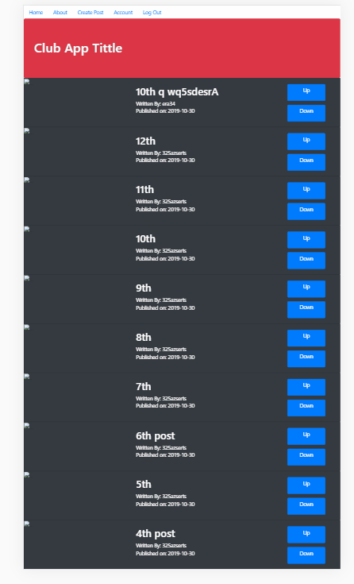

# Club App Shield

## Description:         
### This Flask app is the bare minimum to implent a blog voting system, refresh project updates.

## Functionalities: 
### Create users with password and email. Create blogs and edit them when log in. 

## Technologies used:
### Boostrap and Flask 

